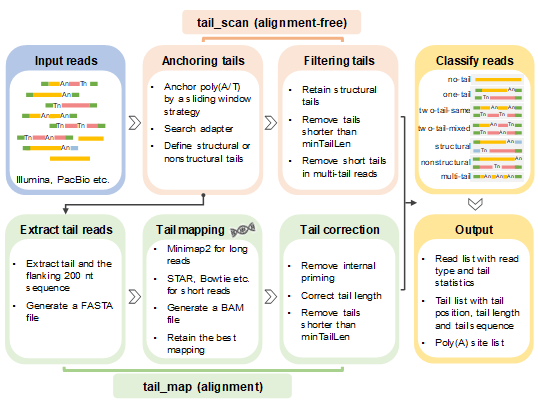

# PolyAtailor
Multifunctional R package for poly(A) tail analysis.
## About
PolyAtailor starts with the original sequencing data, first pre-processed the original data of different sequencing technology, and converted into FASTQ format files. Then entering the tail_scan process, perform tail extraction, tail filtering, and tail classification to get tail_scan tails. If the user provides a reference genome, PolyAtailor will continue to use tail_map to fix the preliminary results of tail_scan to get tail_map tails (Figure below). After obtaining accurate tail data, the user can perform the recognition and annotation of the PA sites, and the visualization analysis of the Poly(A) tail base. In addition, users can also perform differential significant analysis of poly(A) tail length of different conditions via PolyAtailor.   

## Getting started
### Mandatory
* R (>=3.5.0). [R 3.6.3](https://www.r-project.org/) is recommended.
### Required R Packages
* [dplyr](https://CRAN.R-project.org/package=dplyr), [reshape2](https://CRAN.R-project.org/package=reshape2), [IRanges](http://www.bioconductor.org/packages/release/bioc/html/IRanges.html), [GenomicRanges](http://www.bioconductor.org/packages/release/bioc/html/GenomicRanges.html), [RColorBrewer](https://CRAN.R-project.org/package=RColorBrewer), [data.table](https://CRAN.R-project.org/package=data.table), [ggplot2](https://CRAN.R-project.org/package=ggplot2), [Biostrings](http://www.bioconductor.org/packages/release/bioc/html/Biostrings.html), [BSgenome](http://www.bioconductor.org/packages/release/bioc/html/BSgenome.html), [ggbio](http://www.bioconductor.org/packages/release/bioc/html/ggbio.html), [rtracklayer](http://www.bioconductor.org/packages/release/bioc/html/rtracklayer.html), [GenomicFeatures](http://www.bioconductor.org/packages/release/bioc/html/GenomicFeatures.html), [DESeq2](http://www.bioconductor.org/packages/release/bioc/html/DESeq2.html), [DEXSeq](http://www.bioconductor.org/packages/release/bioc/html/DEXSeq.html), [movAPA](https://github.com/BMILAB/movAPA)
### Installation
* Install the R package using the following commands on the R console:

```
install.packages("devtools")
require(devtools)
install_github("XHWUlab/PolyAtailor")
library(PolyAtailor)

##or you can download ZIP, and then
install.packages("you download path", repos = NULL, type = "source")
```  
## Attention
If you encounter the problem that the *ggmsa* package or *GenomicRanges* package does not work in some R versions, you can directly extract the two files in the *patch* folder and copy them to the library path in R.
