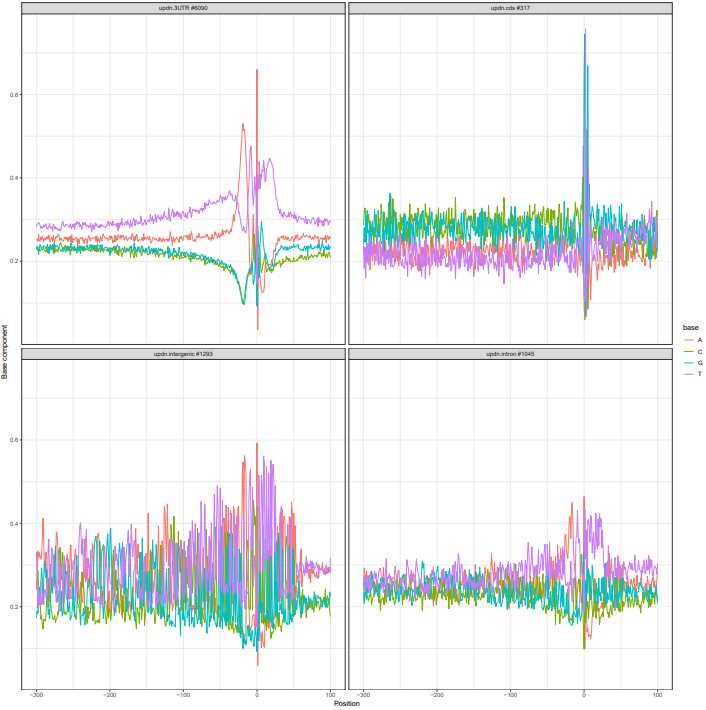
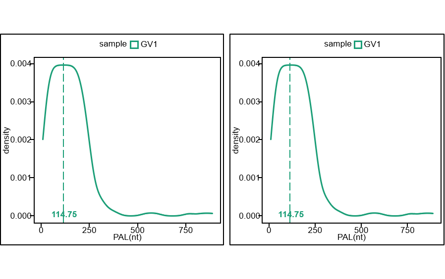
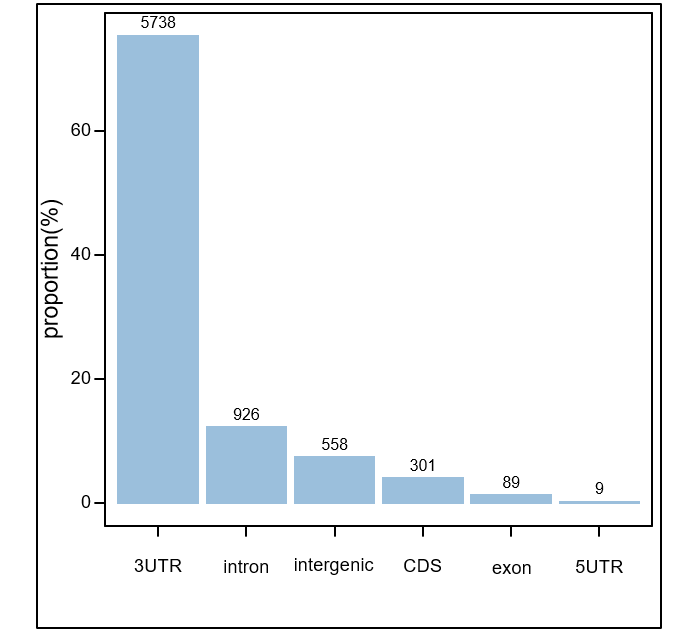
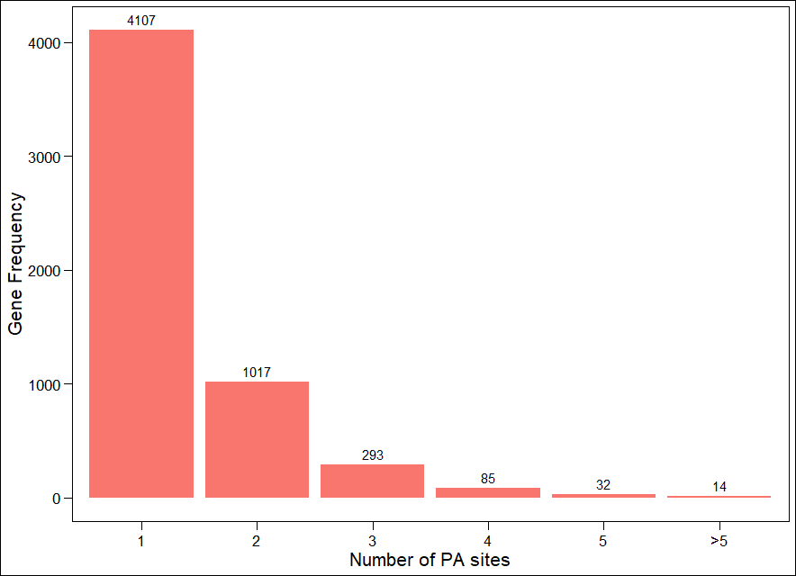
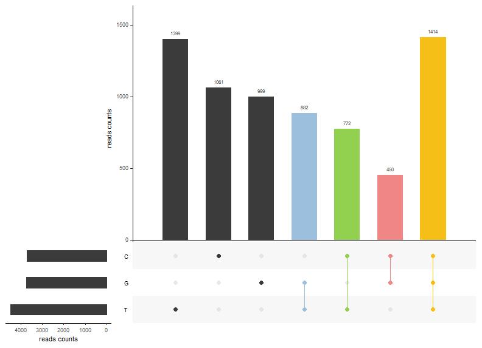
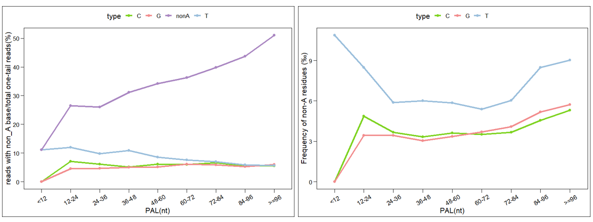

1. Overview

    Here, we will use the PACBIO sequencing data from the mouse GV oocytes cell line published by Yusheng Liu et al. to demonstrate the key functions of PolyAtailor. This includes tail quantification without reference genome, reference genome-based tail quantification, PA site identification and annotation, analysis of base composition in Poly(A) tails and analysis of the significance of differences in Poly(A) tail length under different conditions.
    
2. Preparation

    First, the GV rep1 data (SRR8798075) was downloaded from the NCBI database. The fastq format file contained a total of 63,732 reads, which are all ccs-processed reads and can be used directly for analysis. The tool for sequence alignment is minimap2 (with default parameters) and the reference genome is GRCm38(mm10). Once you have done this you can start using PolyAtailor:

```{r}
# library(PolyAtailor)
```
    
3. Quantitative poly(A) tail with tailScan

    All analyses will start with quantitativing the poly(A) tail. The input to this step is a fastq format file containing reads that have been processed by ccs, and the output will be a dataframe containing all the sequence tail information, Include at least read_num,tail,PAL,chr,strand,tailType,read_type and sample. The median length of all tails found by tailScan is 57nt, which is not far from the 59nt reported in the original article.

```{r, include = FALSE}
knitr::opts_chunk$set(
  collapse = TRUE,
  comment = "#>",
  warning = F,
  fig.width = 6, 
  fig.height = 6,
  eval=FALSE
)
```

```{r setup}
library(polyAtailor)
fastqfile <- system.file("extdata", "./GV_fastq/PAIso_GV1.fastq", package = "PolyAtailor", mustWork = TRUE)
GV1tailDF<-tailScan(fastqfile,mcans=5,findUmi = F,resultpath = "./data/output/",samplename = "GV1",tailAnchorLen=8,minTailLen=8,realTailLen=20,maxNtail=2,mapping=F)
head(GV1tailDF)
#>read_num strand PAL tail tailType read_type nA rt
#SRR8798075.11991 - 9  TTTTTTTTA     structural two-tail-mixed 8  0.89 GV1
#SRR8798075.11991 + 24 TTTTT...ATTGT structural two-tail-mixed 19 0.79 GV1
#SRR8798075.12051 - 13 TTTTTTTTTTTTT structural two-tail-mixed 13 1.00 GV1
#SRR8798075.12051 + 57 TTTTT...TTTTG structural two-tail-mixed 56 0.98 GV1
#SRR8798075.12545 - 28 TTTTT...TGCTT structural two-tail-mixed 21 0.75 GV1
#SRR8798075.12545 + 15 TTTTT...GATCT structural two-tail-mixed 12 0.80 GV1
median(GV1tailDF$PAL)
# [1] 57
```

4. Quantitative poly(A) tail with tailMap

   All analyses will start with quantitativing the poly(A) tail. The input to this tailMap step is a bam file after alignment, and the output will be a dataframe containing all the sequence tail information, Include at least read_num,tail,PAL,chr,coord,strand,tailType,read_type and sample.There are four steps in the tail extraction using the alignment method. The median length of all tails found by tailScan is 59nt.  
    
+ ***Sequence interception***  
  This step will extract the tail from the original sequence and the 200bp sequence around it, generate a FASTA file and save it to the location specified by the user.  
    
+ ***Sequence alignment***  
  Align the sequence obtained in the previous step to the reference genome.  
    
+ ***Tail extract***  
  Extract accurate tail information from BAM files after alignment.  
    
+ ***Gene annotation***  
  Annotate the genetic information for each tail. This step is optional because subsequent annotation of the PA sites can still obtain the genetic information.
    
```{r, include = FALSE}
knitr::opts_chunk$set(
  collapse = TRUE,
  comment = "#>",
  warning = F,
  fig.width = 6, 
  fig.height = 6,
  eval=FALSE
)
```

```{r}
#step1
fastqfile <- system.file("extdata", "./GV_fastq/PAIso_GV1.fastq", package = "PolyAtailor", mustWork = TRUE)
faBuilderRE <- faBuilder(fastqfile,mcans=5,findUmi = F,resultpath = "./data/output/",samplename = "GV1",tailAnchorLen=8,mapping=F)

#step2
  ##alignment with any aligner.
  
#step3
bamfile <- system.file("extdata", "./GV_algin/GV1subseq.sorted.bam", package = "PolyAtailor", mustWork = TRUE)
GV1tailMapre<-tailMap(bamfile,mcans=5,minTailLen=8,findUmi = F,longRead=T)
head(GV1tailMapre)
# read_num                   chr strand coord PAL
# 1  SRR8798075.1004  ENSMUST00000009039.6      -   326  69
# 2 SRR8798075.10180 ENSMUST00000100052.11      -  3273   8
# 3 SRR8798075.10187  ENSMUST00000141115.8      +  9913  10
# 4 SRR8798075.10190  ENSMUST00000139787.8      -   296  40
# 5 SRR8798075.10378 ENSMUST00000055131.13      -  3224  63
# 6 SRR8798075.10430  ENSMUST00000209034.2      -  1661  57
#                                                                    tail
# 1 TTTTTTTTTTTTTTTTTTTTTTTTTTTTTTTTTTTTTTTTTTTTTTTTTTTTTTTTTTTTTTTTTTTTT
# 2                                                              TTTTTTTT
# 3                                                            TTTTTTTTTT
# 4                              TTTTTTTTTTTTTTTTTTTTTTTTTTTTTTTTTTTTTTTT
# 5       TTTTTTTTTTTTTTTTTTTTTTTTTTTTTTTTTTTTTTTTTTTTTTTTTTTTTTTTTTTTATT
# 6             TTTTTTTTTTTTTTTTTTTTTTTTTTTTTTTTTTTTTTTTTTTTTTTTTTTTTTTTT
#     tailType read_type nA       rt sample
# 1 structural  one-tail 69 1.000000    GV1
# 2 structural  one-tail  8 1.000000    GV1
# 3 structural  one-tail 10 1.000000    GV1
# 4 structural  one-tail 40 1.000000    GV1
# 5 structural  one-tail 62 0.984127    GV1
# 6 structural  one-tail 57 1.000000    GV1

#step4
BiocManager::install("TxDb.Mmusculus.UCSC.mm10.knownGene")
library(TxDb.Mmusculus.UCSC.mm10.knownGene)
data(GV1tailDF)
data(GV1tailMapre)
AnnotedTails = geneAnno(tailDF=GV1tailDF,bamdf=GV1tailMapre,GFF=TxDb.Mmusculus.UCSC.mm10.knownGene,longRead=F)
head(AnnotedTails)
# read_num   chr strand  gene gene_type PAL
# 1 SRR8798075.10543  chr3      - 72007      <NA>  11
# 2 SRR8798075.10543  chr3      - 72007      <NA>  17
# 3 SRR8798075.11063 chr10      + 69412      <NA>  89
# 4 SRR8798075.13407 chr14      - 12159      <NA>  89
# 5 SRR8798075.14401 chr14      - 12159      <NA>  43
# 6 SRR8798075.14401 chr14      - 12159      <NA> 119
# tail
# 1 TTTTTTTTTTT
# 2 TTTTTTTTTTTTTTTTT
# 3 TTTTTTT...TTTTTTTTTTTTTTTTTTTTTTTTTTTTTTTTTTTTTTTTTTTT
# 4 TTTTTTT...TTTTTTTTTTTTTTTTTTTTTTTTTTTTTTTTTTTTTTTTTTTTTTTTTTTTTTTTTTTTTT
# 5 TTTTTTTTTTTTTTTTTTTTTTTTTTTTTTTTTTTTTTTTGCT
# 6 TTTTTTT...TTTTTTTTTTTTTTTTTTTTTTTTTTTTTTTTTTTTTTTTTTTTGTGCTTTGCTTTACTTTC
#       tailType      read_type  nA        rt sample
# 1   structural two-tail-mixed  11 1.0000000    GV1
# 2   structural two-tail-mixed  17 1.0000000    GV1
# 3   structural       one-tail  89 1.0000000    GV1
# 4   structural       one-tail  89 1.0000000    GV1
# 5   structural  two-tail-same  41 0.9534884    GV1
# 6 unstructural  two-tail-same 111 0.9327731    GV1
```

5. PA site detection and annotation

    In order to be able to analyze the APA sites of HELA later, we need to identify the PA sites in the sequence and annotate the PA sites we have identified using human annotation information. At the same time, this step will map the base distribution around the PA site and store it as a PDF file in the path you specify.  
    
   ***[NOTE]***  Please note that the chromosome name of the reference genome should be the same as the chromosome name used in the BAM file, otherwise it will result in an error!

```{r}
# Deciphering gff files
BiocManager::install("TxDb.Mmusculus.UCSC.mm10.knownGene")
library(TxDb.Mmusculus.UCSC.mm10.knownGene)
# Deciphering genome files
BiocManager::install("BSgenome.Mmusculus.UCSC.mm10")
library("BSgenome.Mmusculus.UCSC.mm10")
bsgenome = BSgenome.Mmusculus.UCSC.mm10
# Prepare the input file
 bamfilepath = system.file("extdata", "./GV_algin/PAIso-GV1.sorted.bam", package = "PolyAtailor", mustWork = TRUE)
chrinfopath = system.file("extdata", "./GV_algin/chrinfo.txt", package = "PolyAtailor", mustWork = TRUE)
resultpath = "./"
# Annotated PA site
PAs <- findAndAnnoPAs(bamfile=bamfilepath,chrinfo=chrinfopath,resultpath=resultpath,bsgenome=bsgenome,gffFile = TxDb.Mmusculus.UCSC.mm10.knownGene,sample="GV1",mergePAs=T,d=24)

```

<br/>

6. distribution of poly(A) tail length

    Using the PoltPAL family of functions, the tail length distribution of the gene or UMI of different sample will be plotted, as well as the global tail length distribution.  
    The function *plotPALDistribution* will plot the global distribution of tail length under different samples, when the parameter *dType* is equal to "global". When the parameter "dType" is "gene", this function plots the PAL per gene distribution density curve, and when the parameter is "umi", it plots the PAL distribution density curve of PAL per umi.  

```{r}
data(GV1tailMapre)
p1 <- plotPALDistribution(GV1tailMapre,"./data/figures/","global",medianPAL=T)
p1
p2 <- plotPALDistribution(GV1tailMapre,"./data/figures/","gene",medianPAL=T)
p2
```

<br>    
   
8. PA sites analysis

   The statistics of PA sites include three aspects:  
    
+ ***The gene region distribution of PA sites***  
  The plot function *plotPADistribution* will plot the gene region distribution barplot for all PA aites.  
    
```{r}
data(PAs)
p <- plotPADistribution(PAs,"./data/figures/","#9BBFDC")
p
```

<br>   

+ ***The gene frequency with different number of PA sites***  
  The plot function *plotGenePAnumbers* will plot the gene frequency distribution with different number of PA sites.  
    
```{r}
data(PAs)
p <- plotGenePAnumbers(PAs,"./data/figures/","#DF7C7D")
p
```

<br>   

+ ***The occurrence rate of PA signal***  
  The function *Plotpasignals* will plot the probability distribution of the occurrence of user-specified or default PA signal within the first 50bp base range of PA site.  
    
```{r}
library("BSgenome.Mmusculus.UCSC.mm10")
bsgenome = BSgenome.Mmusculus.UCSC.mm10
data(PAs)
p <- plotPASignals(PAs,"./data/figures/",bsgenome = bsgenome)
p
```

<br>      

9. Base composition analysis 

    Polyatailor contains abundant analysis and visualization tools of poly(A) tail base composition, including statistics of the number distribution of reads in different non-A base combinations, analysis of non-A base content in polyAtail of different lengths, and direct visual comparative analysis of intrested tails. All you need to do is enter a table that contains at least the genetic information and the complete tail sequence and all results will be saved in a PDF file. Of course, you can do each analysis separately.  
    
+ ***Frequency of occurrence of different non-A base combinations***  
  The number of reads present in each non-A base combination was calculated in the form of an upset plot, and reads present in multiple non-A base combinations were highlighted, The result can be called directly in the output of the nonAanalysis function. For example, in the tails of GV data, most of the tails contain only one particular non-A base, but there are also a number of tails in which all three non-A bases are present at the same time:

```{r}
data(AnnotedTails)
re <- nonAanalysis(AnnotedTails)
re$p1
```

<br>  

+ ***The base composition of tails of different lengths***  
  The occurrence frequency of non-A bases in different tail lengths was counted at the base level or reads level, which can demonstrate the association between tail length and non-A base frequency to A certain extent.This result can also be invoked in the return result of nonAanalysis. In the results of the GV data we can find that T bases are the most abundant non-A bases.
  
```{r}
re$p2
re$p3
```
   
<br> 
    
+ ***Visualized comparison of tail base composition***  
  In order to show the base composition of the tail more intuitively, we show the interested tails in the form of heat map and logo diagram, so that we can intuitively see the difference of base composition of different tails at the same position.This function requires a separate call to the tailViso function.
    
```{r}
data(taildf)
my_cutstom <- data.frame(names=c("A","C","T","G"),color=c("#3171A5","#4EAA4C","#C9C4C2","#D73D3D"))
p <- tailViso(taildf,tailLen=100,Ntail=20,custom=my_cutstom,strand="-",faPath="D:/",showLogo=T,showReadNum= F)
```
   
<br> 
  
10. Detection of PAL difference significance

    The "PALdsa" function of PolyAtailor package can be used to detect the significant difference of tail length in batch at gene or PA level. We offer four ways to perform the significance of differences in tail length, namely the Mann-Whitney U test, the Kolmogorov-Smimov test, MosesExtreme reaction and the two-sided wilcoxon test, user can select one or all of these for calculation using the parameter "SAoDMethod". In addition to this, the user can also select the visualisation method using the parameters "withViolinPlot" and "withUpsetPlot". However, in the GV data, we only detected significant differences in PAL at the distal and proximal PA sites for 1 gene.
    
```{r}
BiocManager::install("TxDb.Mmusculus.UCSC.mm10.knownGene")
library(TxDb.Mmusculus.UCSC.mm10.knownGene)
gff <- parseGenomeAnnotation(TxDb.Mmusculus.UCSC.mm10.knownGene)
data(AnnotedTails)
files = system.file("extdata", "./output/PAs/PAs.txt", package = "PolyAtailor", mustWork = TRUE)
PAs <- read.table(files,header=TRUE,sep=" ")
diffPAL2PAgenes <- PALdsa(PAs,AnnotedTails,gff,mode="PD",SAoDMethod="ME",withViolinPlot=T,withUpsetPlot=F)

```

<br>   

*****   
***References***     
Ye W, Liu T, Fu H, et al. movAPA: Modeling and visualization of dynamics of alternative polyadenylation across biological samples[J]. Bioinformatics, 2021, 37(16): 2470-2472.   
Liu Y, Nie H, Liu H, et al. Poly (A) inclusive RNA isoform sequencing (PAIso− seq) reveals wide-spread non-adenosine residues within RNA poly (A) tails[J]. Nature communications, 2019, 10(1): 1-13.   
Legnini I, Alles J, Karaiskos N, et al. FLAM-seq: full-length mRNA sequencing reveals principles of poly (A) tail length control[J]. Nature methods, 2019, 16(9): 879-886.
